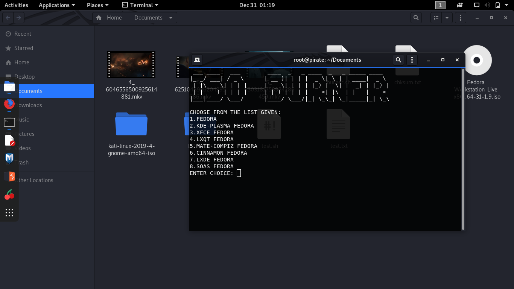

#ISO-BURNER

  * ## Usage:
   Clone the repo in your local machone using :
   ```bash
   $ git clone https://github.com/bashcube/ISO-BURNER.git
   ```
   Move into the directory and execute the bash file with sudo privileges:
   ```bash
   $ cd ISO_BURNER
   $ bash burner.sh
   ```
   
  * ## Description:
    The following bash script automates the process of downloading an iso file 
    Fedora's official website (along with Fedora Spins,if user wishes).
    Then it detects the pendrive and burns the image in the USB-Drive.
    
  * ## Output:
    
